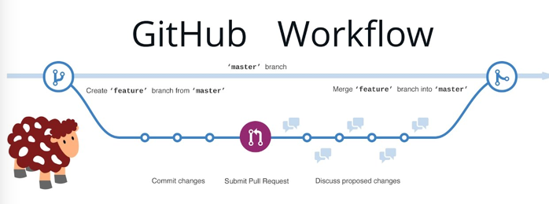

# <dev/Mission>
## Git & Terminal
*Instructor(s): Marcela, Yaritza | Expected Length: 1 Session*
> **Preparation Tips**
:      
> - Recommended having a GitHub account                               
 -
 Recommended having installed iTerm2(iOS) or GitBash(Windows)

## Project
The Git and Terminal session is aimed at giving the participants the basic understanding of how the terminal works, it’s main tools, and how to integrate your terminal to Github. By the end of this project, participants will have created a Git account, will know how to navigate through their computer by the terminal, as well as run code, create new files, pull a project from GitHub, and push a previous project to Github.

## Plan
1. Command Line: explanation and setting it up
  a. What it is & setting it up
  b. Basic commands
2. Git & Version Control
  a. Basic Vocabulary (Git, Repository, Version Control)
  b. Commits
  c. Git Cycle
  d. Git commands
3. Branching in Git
  a. How it works
  b. Commands
  c. Git workflow w/ branches
4. Github
  a. What it is and setting it up
  b. Creating and downloading a git repo
  c. Creating a local repo and pushing it to Github
  d. Forking
  e. Pull Requests

> **Helpful Tips**
:      
> This session has an overwhelming amount of commands - do not worry about memorizing them! There are a bunch of nice cheat sheets you can continually look at, and you will get the hang of the most important ones to you with time :)

## Vocabulary
* **Terminal**:programmer's tool for working with files and running code.
* **Git**: version tracking program used to track changes to files and folders. Git allows you to switch back to older versions of these files.
* **Version Control**: Version control is a system that records changes to a file or set of files over time so that you can recall specific versions later.
* **Repository**: A repository is a version-controlled folder of files - It is where programmers keep their code. Any folder on your computer can become a Git repository. 
* **Commit**: Every time you want to create a save point, you need to enter  in the command line to tell Git, and to tell which files you want to save

## Key Concepts
### Terminal Commands

* `pwd`
Print the current directory.
* `ls`
List files and folders in current directory.
* `mkdir [directory name]`
Make a new directory
It's possible to make multiple folders, just type
`mkdir [folder 1] [folder 2] …`
* `cd [directory or path]`
Change directory to a sub directory or a parent path.
cd with nothing after it will take you back to your user folder
`cd .. takes me to the "parent" folder `
* `touch [file name]`
Create a new file. To create new files inside other files, touch directory/file
putting extensions in your file is not necessary, but it's good to indicate to your computer which program should be opening this file
* `mv [file name] [directory]`
Move a file to a directory
* `mv [file name] [new file name]`
Rename a file
* `cp [original file] [target file]`
Copy a file
* `rm [file]`
Remove a file
* `open [path/file name]`
Open a file with default application
- For Git Bash:  `start [file name]`
* `rmdir [directory] OR rm -r [directory]`
Remove a directory
* `rm -rf [directory]`
Remove a directory and everything inside it
BE CAREFUL! You can accidentally delete a lot of files this way.
* `clear`
Clear the terminal
* `find [direcory] -name [filename]`
Search a directory (and all its subdirectories) for a file. 
Use `.` for the current directory and `~/` for the entire home directory (this can take a long time)

### Git

**What is a Repository?**

 * A repository is a version-controlled folder of files - It is where programmers keep their code. Any folder on your computer can become a Git repository. 

*WARNING (What Should and Should Not Be a Repo)*

- You should not have repos inside repos
- If you run ls -a on the command line and a .git folder shows up there, don't create a new repo in that folder
- Big folders (like Desktop) should not be repos! Repos should be individual project directories
- If you create a new subfolder inside of the repository, you do not need to call git init again.

**What is Git?**

* Run git init to insert a git folder inside your folder ======> repo
* Once the `.git` folder is installed inside your project folder, your project has the power of time travel 😃

**Commiting**

* Git doesn't automatically save versions of your files
* Everytime you want to create a save point, you need to enter  in the command line to tell Git, and to tell which files you want to save
	- Save points - commits
	 * Each commit has: A Unique ID; Author; Date; Message (of what was done)

**Git Commands**

Here are a few Git commands to use on your terminal:

* `git status` OR `git diff [filename]`:  see which changes have been made

The status of a branch in a Git repository tells us if changes have been made to the state of files or folders in the project. Files and folders can be in one of three states:

	• Untracked: A new file that is not yet being tracked.
	• Modified: A file that is tracked and has been modified since the last commit.
	• Staged: Files that are ready to be committed.

* `git add [filename]` : Add a file to git (add the version control power to your changed file)
* `git commit -m [filename]`: In every change, you will want to set a commit with a message. That way, you can distinguish your versions by what you have accomplished (coded) each time you commit
* `git log`  : See your previous versions

**The Git Cycle** 

	Once per Repository
	- Initialize a new repo or clone an existing one (download)

	Over and Over again
	- Change files
	- Add/stage those files for a commit
	- Commit those changes with a message

### Branching in Git

Creating a **branch** in Git gives you a "copy" of your project to work on. You have your `master` branch (the default branch in any repository), which is the original code. You create a branch.

Once a given feature was complete, you could **merge** it back into the original project.

The `master` branch is the default branch, and is created automatically; every other branch is created manually 

* To see in which branch you are in:  `git branch`
* To create new branch: `git checkout -b [file name]` or  `git branch [file name]`
* To switch to other branch: `git checkout [file name]`
* To **delete branch**: `git branch -d [file name]`
* **Merging files**
  * Merging takes the code from a target branch (your feature) and merges it into the current branch (master). As long as there is no conflict between the code on the two branches this happens seamlessly and easily.
	* Go to master branch and `git merge [branch name]`

> To see a list of all Git commands, type `git help`   in your terminal. To learn more about a particular command, type `git help COMMAND-NAME`. 

### Github

**Creating and Downloading a Remote repository**
* You create a Repo on GitHub, on the web interface
* Then, on git, you enter `git clone <URL of the repo>`

**Sharing Code with Other Developers**
* To send your local changes to the GitHub account Repo, type  `git push`  
* To receive changes from other developers that have already "git pushed", type `git pull  `

**Creating a Local repository and Pushing to GitHub**
* After `git init`  , type `git remote add origin <URL>`  (adding a remote to your repo; to see the remotes you have type `git remote -v ` ) , in which the URL is to an empty folder in GitHub created in the web interface specifically to receive this repo folder. 
* Then, type `git push -u origin master` (push that project)

**Forking: Another Way to Share Code**
* Copying a repo from one GitHub account to another GitHub account - the results is two repos that function independently (they can sync, but don't have to)

**Pull Requests**
* You can create a *pull request* on GitHub in order to request that your code be merged from a feature branch into the master branch. Issuing a pull request is a friendly way of saying, "Hey! I'm done implementing this feature your asked for. Can you review my code?"
* Since you do not have a team working on this repository, you can merge your own pull request. *You would usually NOT merge your own pull request unless you are working solo on a project.* When working in a team, it is best practice to have at least one other person review your pull request, and they should be the person to merge it once the changes are approved.

### Resources

[Terminal Crash Course - Reading](https://learnpythonthehardway.org/book/appendixa.html)
[Tutorial: Become a Git Guru - Reading](https://www.atlassian.com/git/tutorials)
[Introduction to GIT/GITHUB - Reading](https://sklise.com/2012/09/22/introduction-to-git/) ***
[Git A-Z Index - Reference](https://ss64.com/bash/)
[Pro Git Book - Reference](https://git-scm.com/book/en/v2)
[Github's Git Cheat Sheet - Reference](https://education.github.com/git-cheat-sheet-education.pdf)
